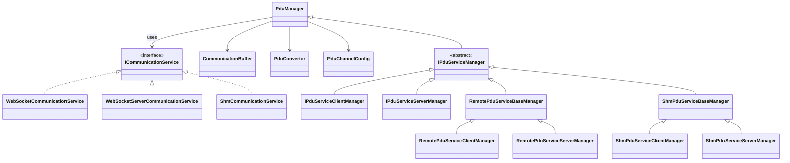

# hakoniwa-pdu-python

[](https://github.com/hakoniwalab/hakoniwa-pdu-python/actions/workflows/tests.yml)

This is a Python PDU communication library for the Hakoniwa simulator.
It allows easy sending/receiving of PDU binary data and conversion to/from JSON over WebSocket.

---

## 📦 Installation

```bash
pip install hakoniwa-pdu
```

Check the installed version:

```bash
pip show hakoniwa-pdu
```

---

## 🔧 Environment Variables

You can specify the directory containing `.offset` files used for PDU conversion:

```bash
export HAKO_BINARY_PATH=/your/path/to/offset
```

If not set, the default path will be:

```
/usr/local/lib/hakoniwa/hako_binary/offset
```

---

## 🏁 Getting Started

### WebSocket Topic

This repository includes a minimal publish/subscribe sample over WebSocket.
The example sends a `geometry_msgs/Twist` PDU from a server to a client.

1. **Start the publisher (server)**

   ```bash
   python examples/topic/websocket/remote_publisher.py \
     --uri ws://localhost:8080 \
     --pdu-config examples/pdu_config.json \
     --service-config examples/service.json
   ```

   `remote_publisher.py` creates a `RemotePduServiceServerManager` backed by
   `WebSocketServerCommunicationService` and publishes incremental `Twist`
   messages to the `pos` topic every second.

2. **Start the subscriber (client)** in another terminal:

   ```bash
   python examples/topic/websocket/remote_subscriber.py \
     --uri ws://localhost:8080 \
     --pdu-config examples/pdu_config.json \
     --service-config examples/service.json
   ```

   The subscriber uses `RemotePduServiceClientManager` with
   `WebSocketCommunicationService` to receive the same `pos` topic. Received
   PDUs are converted back to Python types and printed as:

   ```
   [INFO] Received Twist: linear.x=0 angular.z=0
   [INFO] Received Twist: linear.x=1 angular.z=1
   ```

### WebSocket RPC

This repository also includes a simple RPC sample over WebSocket implementing an `AddTwoInts` service.

1. **Start the RPC server**

   ```bash
   python examples/rpc/websocket/remote_rpc_server.py \
     --uri ws://localhost:8080 \
     --pdu-config examples/pdu_config.json \
     --service-config examples/service.json
   ```

   `remote_rpc_server.py` sets up a `RemotePduServiceServerManager` with
   `WebSocketServerCommunicationService` and registers an `AddTwoInts` handler.

2. **Start the RPC client** in another terminal:

   ```bash
   python examples/rpc/websocket/remote_rpc_client.py \
     --uri ws://localhost:8080 \
     --pdu-config examples/pdu_config.json \
     --service-config examples/service.json
   ```

   The client uses `RemotePduServiceClientManager` to call the same service. A successful call prints:

   ```
   レスポンス: 3
   ```

---

## 📡 Event-driven PDU processing

Server:

```python
server_manager.register_handler_pdu_data(on_pdu)

def on_pdu(client_id, packet):
    ...
```

Client:

```python
client_manager.register_handler_pdu_data(on_pdu)

def on_pdu(packet):
    ...
```

Handlers run after the packet is buffered. You can still poll the buffer using
`contains_buffer` and `get_buffer` if needed.


---

## 📁 Package Structure

```
hakoniwa_pdu/
├── pdu_manager.py                  # Core PDU manager
├── impl/                           # Transport and utilities
│   ├── icommunication_service.py   # Transport interface
│   ├── websocket_communication_service.py      # WebSocket client
│   ├── websocket_server_communication_service.py  # WebSocket server
│   ├── shm_communication_service.py            # Shared memory transport
│   ├── pdu_convertor.py            # Binary ⇔ JSON conversion
│   ├── hako_binary/
│   │   └── *.py (Handles offsets and binary layout)
├── rpc/                            # RPC infrastructure
│   ├── ipdu_service_manager.py     # Base classes for RPC managers
│   ├── protocol_client.py          # High level RPC client helpers
│   ├── protocol_server.py          # High level RPC server helpers
│   ├── auto_wire.py                # Auto load protocol classes
│   ├── remote/                     # RPC over WebSocket
│   │   ├── remote_pdu_service_base_manager.py
│   │   ├── remote_pdu_service_client_manager.py
│   │   └── remote_pdu_service_server_manager.py
│   └── shm/                        # RPC over shared memory
│       ├── shm_pdu_service_base_manager.py
│       ├── shm_pdu_service_client_manager.py
│       └── shm_pdu_service_server_manager.py
├── resources/
│   └── offset/                     # Offset definition files
```

## 🏗️ Class Overview

### PduManager
- `PduManager` orchestrates PDU buffers and delegates transport to an `ICommunicationService`.
- Direct PDU I/O: declare channels with `declare_pdu_for_read/write` then use `flush_pdu_raw_data()` or `read_pdu_raw_data()`.
- RPC usage: extended via `rpc.IPduServiceManager` to handle `register_client`, `start_rpc_service`, and other RPC-specific APIs.

### Communication Implementations (`impl/`)
- `ICommunicationService` defines the transport API.
- `WebSocketCommunicationService` / `WebSocketServerCommunicationService` implement WebSocket transport.
- `ShmCommunicationService` enables high-speed shared-memory transport.
- Choose the backend by passing the desired implementation to `PduManager.initialize()`.

### RPC Layer (`rpc/`)
- `IPduServiceManager` family provides RPC APIs on top of `PduManager` with client/server variants and status codes.
- `protocol_client.py` and `protocol_server.py` wrap these managers into user-friendly protocol classes.
- `auto_wire.py` loads generated PDU converters and constructs protocol clients/servers automatically.
- `remote/` contains WebSocket-based managers; `shm/` provides shared-memory managers.
- `service_config.py` merges service definitions with base PDU definitions.

## 🧭 Class Diagram



---

## 🔗 Links

* 📘 GitHub: [https://github.com/hakoniwalab/hakoniwa-pdu-python](https://github.com/hakoniwalab/hakoniwa-pdu-python)
* 🌐 Hakoniwa Lab: [https://hakoniwa-lab.net](https://hakoniwa-lab.net)

---

## 📚 Documentation

For detailed API usage, refer to the full API reference:

➡️ [API Reference (api-doc.md)](./api-doc.md)

---

## 📜 License

MIT License - see [LICENSE](./LICENSE) for details.

